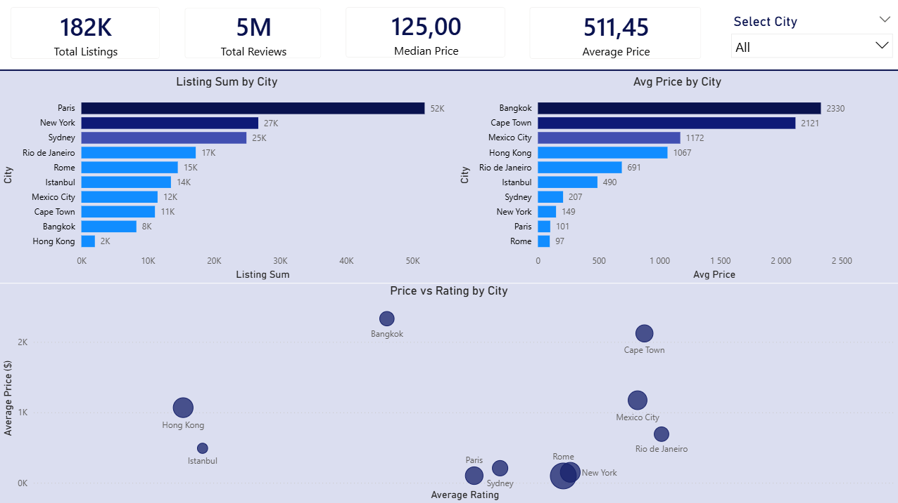
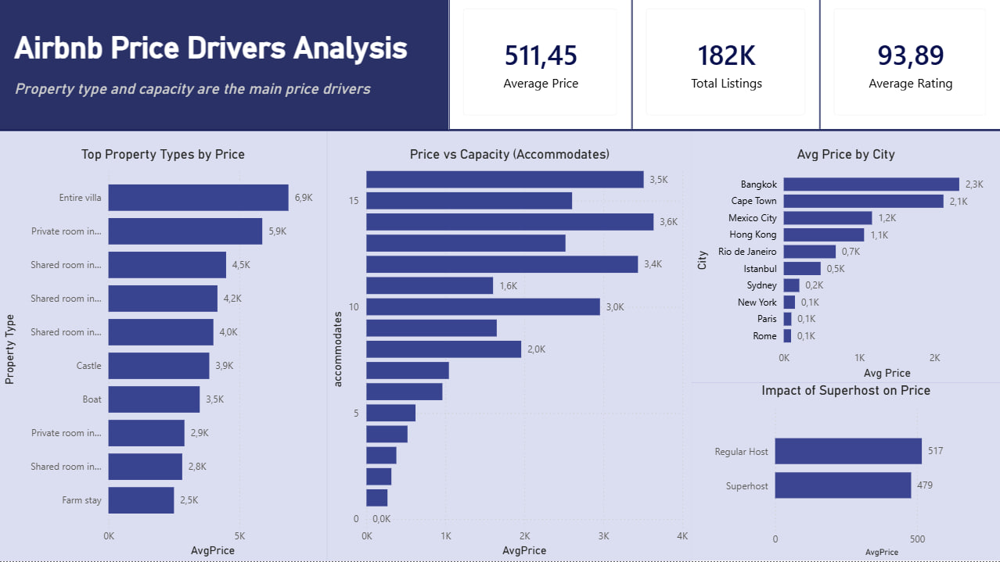
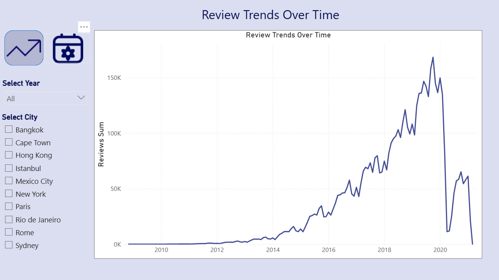
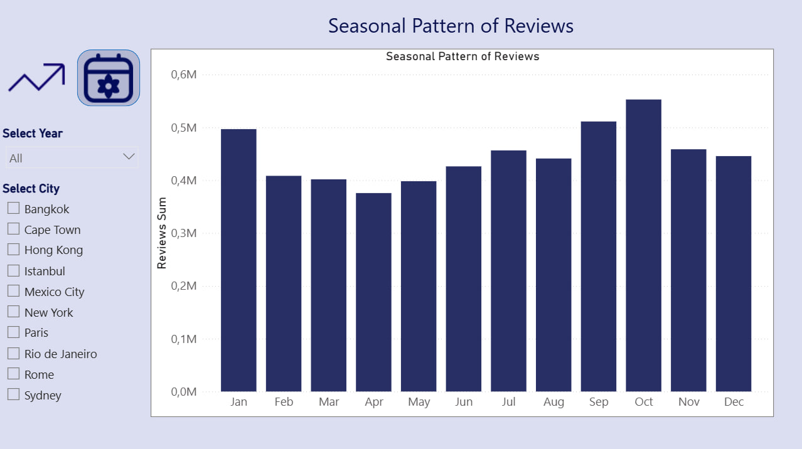
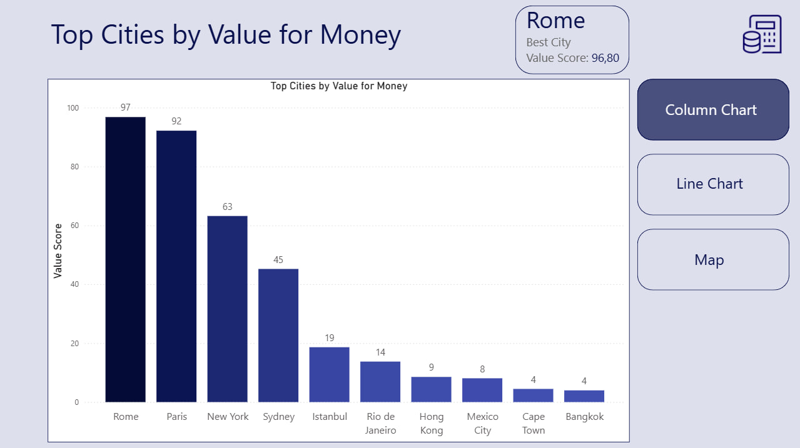

# Airbnb Market Analysis 🏠

## Overview
Analysis of 182,000+ Airbnb listings and 5M reviews across 10 major cities 
to identify pricing trends, market patterns and best value destinations.

## Questions Explored
- What are the biggest differences between cities?
- Which attributes affect price the most?
- Are there any seasonal trends in the data?
- Which city offers the best value for travelers?

## Key Findings
- Paris has the most listings (52K) but one of the lowest avg prices ($101)
- Bangkok has the highest avg price ($2330) despite fewer listings
- New York and Rome offer high ratings at relatively low prices
- Rome scored highest on Value for Money (96.80)
- Strong seasonal patterns identified across multiple cities

## Tools Used
- Power BI (5-page interactive dashboard)
- Dataset: 250,000+ Airbnb listings across 10 cities

## Dashboard Preview

### Market Overview

### Price Drivers Analysis

### Market Trends

### Seasonality

### Best Value City

